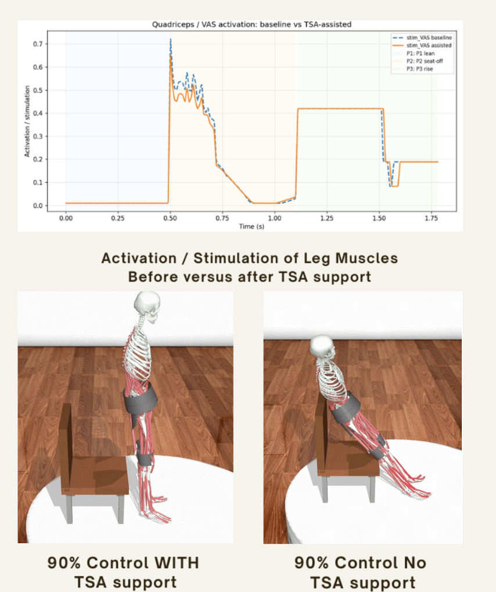
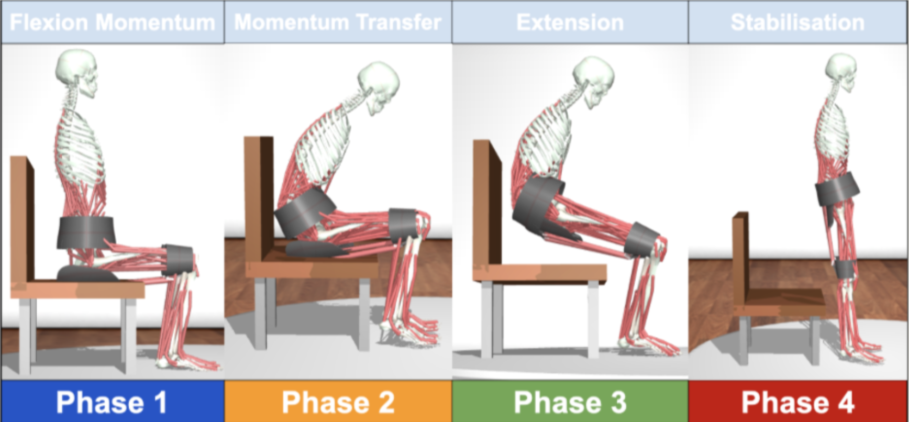

# MyoAssist: Sit-to-Stand Assistance with Efficient Powered Clothing

<p align="center">
  <strong>Musculoskeletal simulation and control of an assistive wearable system for the sit-to-stand movement using biomechanics, feedback control and reinforcement learning.</strong>
</p>

<p align="center">
  
</p>

---

## Overview

This project investigates how **powered assistive clothing** could support a person during a **sit-to-stand (STS)** movement while minimising the amount of external assistance required.

The system was developed using a musculoskeletal human model simulated in **MyoSuite and MuJoCo**. A multi-phase reflex controller was first designed to reproduce the biomechanics of standing from a seated position, before reinforcement learning was introduced to investigate how powered assistance could be applied more efficiently.

The project combines:

- Musculoskeletal simulation
- Biomechanical motion analysis
- Multi-phase reflex control
- Feedback control
- Assistive knee torque
- Reinforcement learning
- Proximal Policy Optimisation (PPO)
- Reward shaping
- Assistance-efficiency optimisation

A central objective was not simply to make the simulated person stand, but to determine **how little powered assistance could be used while still completing the movement successfully**.

---

## Sit-to-Stand Movement

The sit-to-stand movement requires coordinated motion across the torso, pelvis, hips, knees and ankles.

Rather than attempting to control the entire movement with a single set of targets, the movement was divided into **four distinct phases**.

<p align="center">
  
</p>

### Phase 1 — Forward Lean

The first phase moves the upper body forward while the person remains seated.

The aim is to shift the body's centre of mass towards the feet and generate sufficient forward momentum for seat-off.

Important considerations include:

- Forward torso rotation
- Maintaining foot contact with the floor
- Keeping the model stable while seated
- Preparing the pelvis for forward translation

---

### Phase 2 — Momentum Transfer / Seat-Off

During the second phase, the body transitions from being supported by the chair to being supported primarily by the lower limbs.

This is one of the most demanding portions of the movement and requires coordinated action between the torso, pelvis, knees and hips.

The controller must:

- Continue transferring the centre of mass forward
- Begin lifting the pelvis from the seat
- Support increasing body weight through the legs
- Prevent backward movement or loss of balance
- Begin applying knee and hip extension

This was also the phase in which the greatest external assistance was observed.

---

### Phase 3 — Extension

Once sufficient forward momentum has been generated and the pelvis has left the seat, the body begins extending towards the standing position.

The controller coordinates:

- Knee extension
- Hip extension
- Pelvis elevation
- Torso positioning
- Balance over the feet

A major challenge during development was preventing the torso from collapsing while simultaneously generating sufficient vertical motion.

---

### Phase 4 — Stabilisation

The final phase occurs once the body approaches the upright standing position.

The controller attempts to:

- Maintain an upright torso
- Stabilise the pelvis
- Maintain knee and hip extension
- Reduce unnecessary movement
- Confirm successful completion of the sit-to-stand task

The simulation only considers the movement successful once the model satisfies the required standing conditions rather than simply reaching a high pelvis position momentarily.

---

## Control Architecture

The final system combines a **phase-based reflex controller** with external powered assistance.

The overall control process can be represented as:

```text
             Musculoskeletal State
                       │
                       ▼
                Phase Detection
                       │
                       ▼
              Reflex Controller
                /             \
               /               \
              ▼                 ▼
     Muscle Activations    State Feedback
                                │
                                ▼
                      Assistive Controller
                                │
                                ▼
                    Powered Knee Assistance
                                │
                                ▼
                       MuJoCo Simulation
                                │
                                ▼
                    Updated Body State
                                │
                                └──────► Repeat
```

At each simulation step, the current state of the musculoskeletal model is used to determine the active STS phase.

The appropriate reflex targets are then applied and, where required, additional powered assistance is introduced.

---

## Phase-Based Reflex Controller

A **four-phase reflex controller** was developed as the foundation of the sit-to-stand system.

Each phase uses different control objectives corresponding to the biomechanics required at that point in the movement.

This approach made it possible to debug individual portions of the STS motion independently.

For example, early versions of the controller encountered problems including:

- Feet lifting from the floor during the initial phase
- Insufficient forward pelvis movement
- Torso collapse during extension
- Failure to transition effectively from sitting to standing
- Instability after reaching the upright position

Breaking the movement into phases allowed these behaviours to be addressed individually rather than attempting to optimise the entire trajectory simultaneously.

---

## Powered Assistance

The simulated assistive system provides additional torque at the knees.

The intention is to represent the type of assistance that could theoretically be provided by **powered clothing or wearable assistive technology**.

Rather than replacing the biological muscles, the powered system operates alongside the musculoskeletal model.

This allows the simulation to investigate an important question:

> **How much additional assistance is actually required for the movement to succeed?**

Providing very large torques would make standing easier, but would provide little insight into designing an efficient wearable system.

The controller therefore aims to retain as much contribution from the simulated muscles as possible.

---

## Efficient Powered Clothing Reward

<p align="center">
  
</p>

A key part of the reinforcement-learning system was designing a reward that encouraged both **successful standing and efficient assistance**.

The reward concept can be represented as:

```text
                  Total Reward
                       │
          ┌────────────┼────────────┐
          │            │            │
          ▼            ▼            ▼
      Movement      Standing     Stability
      Progress       Success
          │
          └────────────┬────────────┘
                       │
                       +
                       │
                       ▼
              Successful Behaviour

                       -

          ┌────────────┴────────────┐
          │                         │
          ▼                         ▼
  Excessive Assistance       Control Effort
          │
          └────────────┬────────────┘
                       │
                       ▼
                 Penalty Terms
```

The aim is therefore not merely:

> **Make the person stand.**

Instead, the optimisation objective becomes:

> **Make the person stand successfully while using as little unnecessary external assistance as possible.**

This distinction is particularly important for wearable robotics, where excessive assistance can increase:

- Power consumption
- Battery requirements
- Actuator size
- Device weight
- Mechanical complexity
- User dependence on the assistive system

---

## Reinforcement Learning

Reinforcement learning was investigated as a method of learning how external assistance should be applied during the movement.

The project uses **Proximal Policy Optimisation (PPO)** through Stable-Baselines3.

The reinforcement-learning agent interacts with a custom environment wrapped around the existing musculoskeletal simulation.

At each timestep:

1. The simulation provides the current body state.
2. The policy observes information describing the movement.
3. The policy outputs an assistance action.
4. The action modifies the external assistance applied to the model.
5. MuJoCo advances the simulation.
6. A reward is calculated.
7. The process repeats until success, failure or the maximum episode length.

---

## Minimal Assistance Controller

One reinforcement-learning approach focused specifically on **minimal control**.

Rather than asking PPO to learn the complete sit-to-stand movement from scratch, the existing reflex controller provides the underlying movement.

The reinforcement-learning policy then learns how to supplement this behaviour.

This significantly reduces the complexity of the learning problem.

The policy is rewarded for successful movement while being penalised for excessive assistance.

Conceptually:

```text
Reflex Controller
       +
Learned Assistance
       │
       ▼
Sit-to-Stand Motion
       │
       ▼
Was the movement successful?
       │
   ┌───┴────┐
   │        │
  Yes       No
   │        │
   ▼        ▼
Reward    Penalty
   │
   ▼
Subtract Assistance Cost
```

The resulting policy therefore has an incentive to use assistance only where it provides useful benefit.

---

## Feedback Assistance Controller

A second approach incorporated additional **feedback from the current body state**.

Instead of relying purely on a predetermined assistance profile, the controller can respond to how the simulated person is actually progressing through the movement.

This is useful because two STS movements may not evolve identically even when they begin from similar positions.

Feedback allows the controller to respond to variations in:

- Joint position
- Body posture
- Pelvis position
- Movement progress
- Current STS phase
- Standing stability

This provides a more adaptive approach to assistance.

---

## PPO Configuration

The reinforcement-learning experiments used **Proximal Policy Optimisation (PPO)**.

PPO was selected because it provides relatively stable policy updates for continuous-control environments such as musculoskeletal simulation.

Example training parameters used during development included:

```text
Algorithm:       PPO
Environment:     Custom MyoSuite / MuJoCo wrapper
n_steps:         64
batch_size:      32
Episode length:  Up to ~3500 simulation steps
Training:        Hundreds of simulated STS episodes
```

The controller was iteratively evaluated by replaying trained policies within the underlying simulation.

---

## Reward Design

Reward shaping was one of the most important aspects of the reinforcement-learning system.

A reward based solely on final standing height could encourage unwanted behaviours that technically satisfy the objective without representing a realistic STS movement.

The reward therefore incorporates multiple objectives.

### Positive Reward Components

The policy can be rewarded for:

- Forward movement during the appropriate phase
- Increasing pelvis height
- Progressing through the STS phases
- Approaching an upright posture
- Maintaining balance
- Reaching a stable standing configuration
- Successfully completing the full movement

### Penalties

The controller can be penalised for:

- Excessive powered assistance
- Unnecessary control effort
- Unstable posture
- Failure to progress
- Falling
- Invalid body configurations
- Failing to complete the movement within the episode

Together, these terms encourage behaviour that is both **successful and efficient**.

---

## Simulation Results

<p align="center">
  
</p>

The final controller was able to reproduce the complete sit-to-stand movement while supplementing the musculoskeletal model with relatively small external knee torques.

The peak assistance observed during the successful movement was:

| Metric | Result |
|---|---:|
| **Peak assistance per knee** | **7.32 Nm** |
| **Peak bilateral assistance** | **14.64 Nm** |
| **Time of peak assistance** | **2.83 s** |
| **STS phase at peak assistance** | **Phase 2** |

The highest level of external assistance occurred during **Phase 2**, corresponding approximately to the transition between forward momentum generation and lifting the body from the seated position.

This is consistent with the controller requiring its greatest additional contribution around seat-off before reducing assistance as the body progresses through extension and stabilisation.

---

## Why Minimise Assistance?

A successful assistive controller could simply apply enough torque to force the simulated body into a standing position.

However, this would not necessarily represent a useful wearable-assistance strategy.

An efficient assistive device should ideally:

- Preserve the user's own muscular contribution
- Provide assistance primarily when needed
- Avoid excessive joint torque
- Reduce actuator power requirements
- Reduce energy consumption
- Reduce required battery capacity
- Allow lighter wearable hardware

The project therefore treats assistance minimisation as part of the control objective rather than simply maximising task success.

---

## Technical Challenges

### Maintaining Foot Contact

One early issue was that the feet could lift during the initial forward-lean phase.

While the model appeared to move towards standing, the resulting movement was biomechanically unstable.

The phase controller was adjusted to ensure sufficient lower-body stability while allowing forward torso motion.

---

### Generating Forward Momentum

A sit-to-stand movement cannot be reproduced effectively by simply moving the body vertically.

The centre of mass must first move forward towards the base of support.

The controller therefore had to generate sufficient forward movement before beginning the major extension phase.

---

### Pelvis Position

Another challenge was achieving sufficient forward displacement of the pelvis.

Without this movement, the model could attempt to extend while the centre of mass remained too far behind the feet.

The controller was adjusted so that forward pelvis movement occurred before strong vertical extension.

---

### Preventing Torso Collapse

During early versions of Phase 3, the lower body could begin extending while the torso collapsed forwards.

Improved coordination between torso, hip and knee targets was required to maintain a stable upper-body trajectory while standing.

---

### Stable Final Posture

Reaching a high pelvis position did not necessarily mean the model had successfully completed the task.

The final phase therefore included conditions relating to posture and stability so that success represented an actual standing configuration.

---

### Balancing Assistance and Independence

The easiest way to improve success is often to increase external torque.

However, this conflicts directly with the goal of efficient powered clothing.

Reward shaping and control penalties were therefore used to discourage the policy from simply relying on large assistive actions.

---

## Technologies

### Robotics & Simulation

- **MuJoCo**
- **MyoSuite**
- Musculoskeletal modelling
- Physics simulation
- Biomechanical control
- Feedback control

### Reinforcement Learning

- **Stable-Baselines3**
- **Proximal Policy Optimisation (PPO)**
- Custom reinforcement-learning environments
- Reward shaping
- Continuous control

### Programming & Scientific Computing

- **Python**
- NumPy
- Matplotlib
- Gym / Gymnasium-style environments

---

## Project Structure

The project contains the simulation environments, reflex controllers, reinforcement-learning wrappers and analysis scripts used throughout development.

A simplified organisation is:

```text
TSASTSProject/
│
├── controllers/
│   └── Sit-to-stand reflex and assistance controllers
│
├── environments/
│   └── MyoSuite / MuJoCo environment wrappers
│
├── reinforcement_learning/
│   ├── PPO training
│   ├── Minimal-assistance wrapper
│   └── Feedback-assistance wrapper
│
├── analysis/
│   └── Reward and assistance analysis
│
├── videos/
│   └── Simulation recordings
│
├── stsbeforeafter.png
├── stsphases.png
├── efficient powered clothing.png
│
└── README.md
```

> The exact source-file organisation may differ from the simplified structure above; this diagram describes the main functional parts of the project.

---

## Installation

### 1. Clone the Repository

```bash
git clone https://github.com/YOUR-USERNAME/YOUR-REPOSITORY.git
cd YOUR-REPOSITORY
```

### 2. Create a Virtual Environment

```bash
python -m venv .venv
```

Activate it on macOS/Linux:

```bash
source .venv/bin/activate
```

On Windows:

```powershell
.venv\Scripts\activate
```

### 3. Install Dependencies

The project requires a Python environment containing the simulation and reinforcement-learning dependencies.

For example:

```bash
pip install numpy matplotlib mujoco myosuite stable-baselines3 gymnasium
```

Depending on the MyoSuite version used, additional environment-specific dependencies may also be required.

---

## Running the Project

The repository contains multiple experiments and controller implementations rather than a single standalone application.

The general workflow is:

```text
Load MyoSuite STS Environment
            │
            ▼
Initialise Reflex Controller
            │
            ▼
Apply STS Phase Logic
            │
            ▼
Optionally Load PPO Assistance Policy
            │
            ▼
Run MuJoCo Simulation
            │
            ▼
Record State / Reward / Assistance
            │
            ▼
Analyse Successful Episode
```

For reinforcement-learning experiments, the relevant training script can be run to train a PPO policy before evaluating the resulting model in the sit-to-stand environment.

---

## Development Process

The controller was developed iteratively rather than attempting to learn the entire task immediately.

### Stage 1 — Establish the Simulation

The MyoSuite musculoskeletal model was configured for the sit-to-stand task and the relevant body states and actuators were identified.

### Stage 2 — Develop the Reflex Controller

A deterministic phase-based controller was created to establish a reliable STS movement.

### Stage 3 — Debug Individual Phases

Problems such as:

- hovering feet
- insufficient forward movement
- torso collapse
- pelvis positioning
- standing instability

were addressed individually.

### Stage 4 — Introduce Powered Assistance

External knee torque was added to model assistance from wearable powered clothing.

### Stage 5 — Reinforcement Learning

PPO wrappers were introduced to investigate whether the assistance profile could be learned and reduced.

### Stage 6 — Efficiency Analysis

Successful episodes were analysed to determine:

- when assistance was applied
- peak assistive torque
- phase of peak assistance
- total control effort
- whether the full STS movement was completed

---

## What I Learned

This project provided practical experience across the intersection of **robotics, biomechanics, control systems and machine learning**.

In particular, I gained experience with:

- Building simulations in MuJoCo
- Working with MyoSuite musculoskeletal environments
- Designing multi-phase control systems
- Understanding sit-to-stand biomechanics
- Developing feedback and reflex controllers
- Creating custom reinforcement-learning environments
- Training PPO agents
- Continuous action-space control
- Reward-function design
- Balancing competing optimisation objectives
- Analysing actuator torque
- Debugging complex physical simulations
- Evaluating successful and failed motion trajectories
- Integrating conventional control with reinforcement learning

One of the most important lessons from the project was that **task success alone is not necessarily a sufficient objective**.

For assistive robotics, *how* a movement is completed — including stability, user contribution and required actuator effort — can be just as important as whether the final pose is reached.

---

## Potential Improvements

There are several directions in which the project could be extended.

### Personalised Models

The controller could be evaluated across simulated users with different:

- Muscle strengths
- Body dimensions
- Joint limitations
- Mobility impairments
- Fatigue levels

This would allow investigation into personalised assistance strategies.

### Learned Phase Transitions

The current system uses explicitly defined STS phases.

A future controller could learn phase transitions directly from the biomechanical state rather than relying on predefined thresholds.

### Multi-Joint Assistance

The current work focuses primarily on knee assistance.

Future powered-clothing models could investigate assistance at:

- Hip joints
- Ankles
- Multiple joints simultaneously

### Energy-Based Optimisation

Instead of only penalising torque magnitude, future policies could explicitly optimise:

- Mechanical work
- Electrical energy consumption
- Battery usage
- Peak actuator power

### Reference Motion Data

Motion-capture recordings of human STS movements could be incorporated as reference trajectories.

This would provide an additional objective for evaluating movement realism.

### Robustness Testing

The controller could be tested under different initial conditions, including:

- Different chair heights
- Altered foot positions
- Different torso orientations
- Reduced muscle strength
- External disturbances

### Alternative RL Algorithms

Other continuous-control algorithms could be compared with PPO, such as:

- Soft Actor-Critic (SAC)
- Twin Delayed DDPG (TD3)

### Sim-to-Real Investigation

Future work could investigate how policies developed in simulation might transfer to physical assistive hardware.

This would require addressing issues such as:

- Sensor noise
- Actuator delays
- Model mismatch
- Safety constraints
- Human-device interaction

---

## Applications

The methods investigated in this project are relevant to areas including:

- Assistive robotics
- Rehabilitation robotics
- Exoskeletons
- Powered clothing
- Mobility assistance
- Human-robot interaction
- Biomechanical simulation
- Reinforcement-learning control

The same general approach could also be adapted to other assisted human movements beyond sit-to-stand.

---

## Disclaimer

This project is a **research and simulation prototype**.

The simulated controller, reinforcement-learning policies and reported assistance values have not been clinically validated and should not be interpreted as recommendations for real-world rehabilitation, medical treatment or assistive-device torque requirements.

---

## Author

Developed as a robotics and assistive-technology research project exploring **efficient powered assistance for the sit-to-stand movement**.